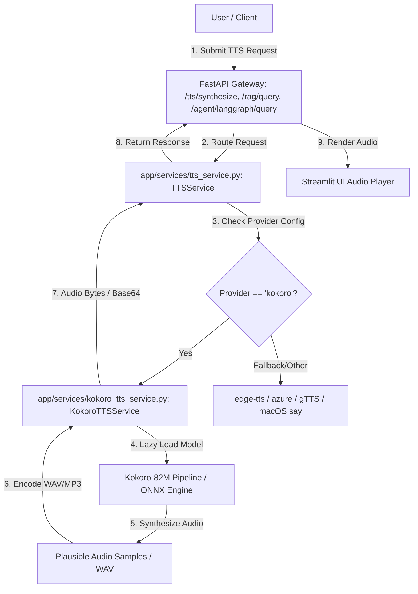

# Kokoro TTS Integration Plan

> **Purpose:** Define a detailed architecture and step-by-step implementation plan to integrate **Kokoro TTS** (~82M open-source local neural TTS) into the Knowledge Base Application.
> **Scope:** Add Kokoro TTS as a premier 100% local, privacy-first, ultra-fast neural speech synthesis provider alongside existing engines (`edge-tts`, `azure`, `gTTS`, `say`, `pyttsx3`).

---

## 1. Executive Summary & Objective

**Kokoro-82M** is a state-of-the-art open-source text-to-speech model featuring high quality, natural-sounding neural voices while maintaining a lightweight footprint (~82M parameters). 

By integrating Kokoro TTS into our backend:
1. **100% Local Neural Synthesis**: Generate high-quality voice audio completely offline on CPU, Apple Silicon (MPS), or CUDA GPU without cloud API calls or rate limits.
2. **Multi-Engine Pipeline**: Seamlessly add `kokoro` into the `TTSService` provider selection and fallback hierarchy (`kokoro` -> `edge-tts` -> `azure` -> `gTTS` -> macOS `say` -> `pyttsx3`).
3. **Rich Voice Selection**: Support Kokoro's neural voice profiles (e.g., `af_heart`, `af_bella`, `am_adam`, `am_michael`, `bf_emma`) with custom speaking speed controls.



---

## 2. Technical Stack & Dependencies

| Component | Library / Tool | Role & Description |
| :--- | :--- | :--- |
| **Primary Engine** | `kokoro` (or `kokoro-onnx`) | Open-source local neural TTS model inference engine |
| **Audio Processing** | `soundfile` & `io.BytesIO` | In-memory WAV file encoding and array manipulation |
| **Model Runtime** | PyTorch / ONNX Runtime | CPU / MPS / CUDA inference execution |
| **Service Adapter** | `KokoroTTSService` | Dedicated wrapper in `app/services/kokoro_tts_service.py` |
| **Integration Point** | `TTSService` | Central manager in `app/services/tts_service.py` |

---

## 3. Implementation Plan by Phases

### Phase 1: Dependencies & Configuration Setup

#### 1.1 Dependency Management (`requirements.txt` / `pyproject.toml`)
Add required packages:
```text
kokoro>=0.3.1
soundfile>=0.12.1
# Optional lightweight ONNX alternative:
# kokoro-onnx>=0.3.0
```

#### 1.2 Application Settings (`app/config/settings.py`)
Add Kokoro TTS configuration fields:
```python
kokoro_tts_enabled: bool = True
kokoro_tts_voice: str = "af_heart"
kokoro_tts_speed: float = 1.0
kokoro_tts_lang_code: str = "a"  # 'a' for US English, 'b' for UK English
kokoro_tts_use_onnx: bool = False
```

---

### Phase 2: Core Kokoro TTS Service (`app/services/kokoro_tts_service.py`)

Create a dedicated service class implementing lazy model loading and audio synthesis.

```python
"""Kokoro-82M Local Neural Text-to-Speech Service."""

import io
import base64
import logging
from typing import Optional, Tuple
import numpy as np

logger = logging.getLogger(__name__)

class KokoroTTSService:
    """Wrapper for Kokoro local neural TTS inference."""

    def __init__(self, default_voice: str = "af_heart", default_lang: str = "a"):
        self.default_voice = default_voice
        self.default_lang = default_lang
        self._pipeline = None

    def _get_pipeline(self, lang_code: Optional[str] = None):
        """Lazy-load the Kokoro Pipeline singleton."""
        if self._pipeline is None:
            try:
                from kokoro import KPipeline
                lang = lang_code or self.default_lang
                logger.info(f"Initializing Kokoro TTS KPipeline with lang_code='{lang}'...")
                self._pipeline = KPipeline(lang_code=lang)
            except Exception as e:
                logger.error(f"Failed to initialize Kokoro TTS pipeline: {e}")
                raise RuntimeError(f"Kokoro TTS initialization error: {e}")
        return self._pipeline

    def synthesize_bytes(
        self,
        text: str,
        voice: Optional[str] = None,
        speed: float = 1.0,
        audio_format: str = "wav"
    ) -> bytes:
        """Synthesize text into raw audio bytes (WAV)."""
        if not text or not text.strip():
            return b""

        import soundfile as sf
        pipeline = self._get_pipeline()
        selected_voice = voice or self.default_voice

        # Generate audio using Kokoro pipeline
        generator = pipeline(text, voice=selected_voice, speed=speed, split_pattern=r'\n+')
        audio_segments = []

        for gs, ps, audio in generator:
            if audio is not None:
                audio_segments.append(audio)

        if not audio_segments:
            logger.warning("Kokoro TTS generated empty audio.")
            return b""

        full_audio = np.concatenate(audio_segments)

        # Write to in-memory WAV buffer (24kHz sampling rate for Kokoro)
        buffer = io.BytesIO()
        sf.write(buffer, full_audio, 24000, format='WAV')
        buffer.seek(0)
        return buffer.read()

    def synthesize_base64(
        self,
        text: str,
        voice: Optional[str] = None,
        speed: float = 1.0
    ) -> str:
        """Synthesize text into Base64-encoded audio string."""
        audio_bytes = self.synthesize_bytes(text, voice=voice, speed=speed)
        if not audio_bytes:
            return ""
        return base64.b64encode(audio_bytes).decode("utf-8")
```

---

### Phase 3: Integration into Multi-Engine `TTSService`

Update `app/services/tts_service.py` to route requests to `KokoroTTSService` when selected or as the primary local provider.

#### 3.1 Extended Provider Chain (`app/services/tts_service.py`)
```python
# Provider check in TTSService.synthesize_bytes:
if provider == "kokoro":
    try:
        from app.services.kokoro_tts_service import KokoroTTSService
        kokoro_service = KokoroTTSService(
            default_voice=settings.kokoro_tts_voice,
            default_lang=settings.kokoro_tts_lang_code
        )
        return kokoro_service.synthesize_bytes(clean_text, voice=voice, speed=speed)
    except Exception as exc:
        logger.warning(f"Kokoro TTS failed ({exc}), falling back to next provider...")
        # Fallback to edge-tts -> gTTS -> macOS say -> pyttsx3
```

---

### Phase 4: API & Data Schemas

#### 4.1 Schema Updates (`app/models/schemas.py`)
Add `speed` and expanded `voice` fields to `TTSRequest`:
```python
class TTSRequest(BaseModel):
    text: str = Field(..., description="Text content to synthesize into speech")
    voice: Optional[str] = Field(None, description="Voice identifier (e.g., af_heart, en-US-AvaNeural)")
    provider: Optional[str] = Field(None, description="TTS Provider: kokoro, edge-tts, azure, gtts, say, pyttsx3")
    speed: Optional[float] = Field(1.0, ge=0.5, le=2.0, description="Speaking rate multiplier")
    audio_format: Optional[str] = Field("wav", description="Target audio format")
```

#### 4.2 API Endpoint Enhancements (`app/api/tts.py`)
Update `/tts/synthesize` and `/tts/stream` to respect the `kokoro` provider, custom voices, and speaking speed.

---

### Phase 5: Streamlit Frontend UI Integration (`frontend/app.py`)

1. **Sidebar Configuration**:
   - Add `kokoro` to the Provider dropdown (`["kokoro", "edge-tts", "azure", "gTTS", "macos-say", "pyttsx3"]`).
   - Expose Kokoro voice profiles: `af_heart` (Female), `af_bella` (Female), `am_adam` (Male), `am_michael` (Male), `bf_emma` (British Female).
   - Add a Speed slider (`0.5x` to `2.0x`).
2. **Audio Controls**: Render HTML5 `<audio>` player with WAV support.

---

### Phase 6: Testing & Verification Plan

#### 6.1 Unit Tests (`tests/test_kokoro_tts_service.py`)
- Test initialization and lazy pipeline loading.
- Test `synthesize_bytes` returning non-empty WAV bytes with mocked `KPipeline`.
- Test `synthesize_base64` output string validity.
- Test fallback behavior when `KPipeline` raises an error.

#### 6.2 Integration & API Tests (`tests/test_tts_api.py`)
- Test `POST /tts/synthesize` with `provider="kokoro"`.
- Test `POST /tts/stream` streaming `audio/wav`.
- Verify RAG and LangGraph voice answers include Kokoro audio attachments when `provider="kokoro"`.

---

## 4. Summary of Files to Modify / Create

- 🆕 `file:///Users/sulabh/Documents/Knowledge%20Base%20Application/.skills/kokoro-tts.md` *(This Spec File)*
- 🆕 `file:///Users/sulabh/Documents/Knowledge%20Base%20Application/app/services/kokoro_tts_service.py` *(Kokoro Service Implementation)*
- 🆕 `file:///Users/sulabh/Documents/Knowledge%20Base%20Application/tests/test_kokoro_tts_service.py` *(Unit Test Suite)*
- ✏️ `file:///Users/sulabh/Documents/Knowledge%20Base%20Application/app/config/settings.py` *(Settings)*
- ✏️ `file:///Users/sulabh/Documents/Knowledge%20Base%20Application/app/services/tts_service.py` *(Provider Routing & Fallbacks)*
- ✏️ `file:///Users/sulabh/Documents/Knowledge%20Base%20Application/app/models/schemas.py` *(Request/Response Models)*
- ✏️ `file:///Users/sulabh/Documents/Knowledge%20Base%20Application/app/api/tts.py` *(API Endpoints)*
- ✏️ `file:///Users/sulabh/Documents/Knowledge%20Base%20Application/frontend/app.py` *(Streamlit UI)*
- ✏️ `file:///Users/sulabh/Documents/Knowledge%20Base%20Application/README.md` *(Documentation Update)*

---

## 5. Success Verification Checklist

- [x] Install `kokoro` & `soundfile` packages in `requirements.txt`.
- [x] Create `.skills/kokoro-tts.md` specification.
- [x] Implement `app/services/kokoro_tts_service.py`.
- [x] Connect Kokoro provider in `app/services/tts_service.py`.
- [x] Update schema & settings in `app/config/settings.py` and `app/models/schemas.py`.
- [x] Update `/tts/synthesize` and `/tts/stream` API endpoints in `app/api/tts.py`.
- [x] Add Kokoro voice options and speed controls in Streamlit UI (`frontend/app.py`).
- [x] Execute pytest test suite for Kokoro TTS integration (`pytest tests/test_kokoro_tts_service.py tests/test_tts_service.py tests/test_tts_api.py`).
