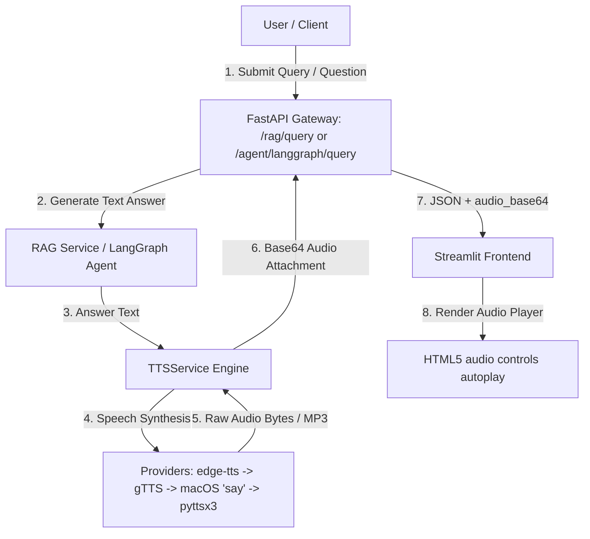

# Skill & Implementation Plan: Text-to-Audio (TTS) Integration

> **Target Goal**: Enable automatic Text-to-Speech (TTS) speech synthesis so users can **hear** the text output generated by RAG queries, LangGraph agent responses, and dedicated audio generation endpoints.

---

## 1. Executive Summary & How to Hear Text Outputs

The **Text-to-Audio** feature automatically converts AI-generated text answers (from the RAG search pipeline or LangGraph multi-step agent) into spoken voice audio.

### How it Works in the Application:
1. **RAG Query Tab**: Submit any text or voice question. The AI answer is rendered as text AND an **HTML5 Audio Player** automatically plays/renders the spoken text answer!
2. **LangGraph Agent Tab**: Submit a question to the agent. The multi-step reasoning response is rendered as text AND an accompanying audio player is generated.
3. **Text-to-Audio Synthesizer Tab**: Enter custom text to synthesize audio on demand using customizable AI voices (`en-US-AvaNeural`, `en-US-AndrewNeural`, `en-GB-SoniaNeural`).



---

## 2. Technical Stack & Multi-Engine Provider Strategy

| Engine / Layer | Technology Choice | Priority & Purpose |
| :--- | :--- | :--- |
| **Primary Engine** | `edge-tts` (Microsoft Neural TTS) | High quality, natural neural voices (`en-US-AvaNeural`, `en-US-AndrewNeural`) |
| **Secondary Engine** | `gTTS` (Google Text-to-Speech) | High reliability cloud TTS fallback |
| **macOS Native Speech** | `/usr/bin/say` + `/usr/bin/afconvert` | Built-in zero-dependency local speech engine for macOS |
| **Offline Python Engine** | `pyttsx3` | Offline cross-platform fallback |
| **Frontend Renderer** | Streamlit `st.audio` & HTML5 `<audio autoplay>` | Audio player controls for instant listening |

---

## 3. Implementation Details

### Phase 1: Core Service & Multi-Engine Setup

#### 1.1 Configuration (`app/config/settings.py`)
```python
enable_tts: bool = True
tts_provider: str = "edge-tts"
tts_default_voice: str = "en-US-AvaNeural"
tts_audio_format: str = "mp3"
```

#### 1.2 Multi-Engine TTSService (`app/services/tts_service.py`)
- Cleans markdown symbols (`#`, `*`, `` ` ``) for smooth audio flow.
- Synthesizes speech via `edge-tts` ➔ `gTTS` ➔ macOS native `say` ➔ `pyttsx3`.
- Encodes audio bytes into Base64 (`synthesize_base64`).

---

### Phase 2: Data Schemas & API Integration

#### 2.1 Pydantic Schemas (`app/models/schemas.py`)
- Default `include_audio: bool = True` in `RAGQueryRequest` and `LangGraphQueryRequest`.
- Output fields `audio_base64: Optional[str]` and `audio_url: Optional[str]` in responses.
- `TTSRequest` and `TTSResponse` for standalone `/tts/synthesize` endpoint.

#### 2.2 API Routers (`app/api/tts.py`, `app/api/rag.py`, `app/api/langgraph.py`)
- `POST /tts/synthesize`: Synthesizes arbitrary input text into audio.
- `POST /tts/stream`: Streams audio bytes directly (`audio/mpeg`).
- `/rag/query` & `/agent/langgraph/query`: Automatically attaches `audio_base64` to answers.

---

### Phase 3: Streamlit UI Audio Player (`frontend/app.py`)

#### 3.1 Audio Control & Player
- `🔊 Enable Text-to-Speech Output` toggle switch in sidebar.
- `render_audio_player(result)` helper function:
  ```python
  def render_audio_player(result: dict):
      audio_b64 = result.get("audio_base64")
      if audio_b64:
          audio_bytes = base64.b64decode(audio_b64)
          st.subheader("🔊 Audio Output")
          st.audio(audio_bytes, format="audio/mp3")
  ```
- Dedicated tab: `🔊 Text-to-Audio (TTS) Synthesizer`.

---

## 4. Verification Checklist

- [x] Install `gTTS` and `edge-tts` packages in `.venv`.
- [x] Configure `enable_tts` settings in `app/config/settings.py`.
- [x] Implement multi-engine fallback in `app/services/tts_service.py`.
- [x] Update request/response models in `app/models/schemas.py`.
- [x] Create standalone `/tts/synthesize` and `/tts/stream` API endpoints in `app/api/tts.py`.
- [x] Integrate TTS speech generation into `app/api/rag.py` and `app/api/langgraph.py`.
- [x] Add audio player and dedicated TTS tab in `frontend/app.py`.
- [x] Run unit & integration test suite (`tests/test_tts_service.py` and `tests/test_tts_api.py`).
