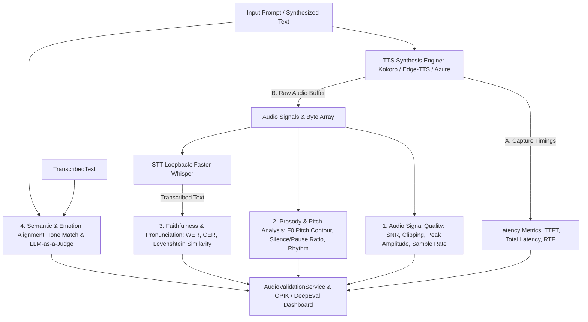

# TTS Evaluation Metrics & Quality Benchmarking Specification

> **Purpose:** Define an end-to-end evaluation, benchmarking, and quality assessment plan for Text-to-Speech (TTS) models (Kokoro TTS, Edge TTS, Azure Speech, etc.).
> **Scope:** Measure Pronunciation Accuracy, Naturalness, Prosody, Emotion Alignment, Text Faithfulness (WER/CER), Signal Quality (SNR/Clipping), and Real-Time Performance (RTF, TTFT).

---

## 1. Executive Summary & Evaluation Architecture

Evaluating Text-to-Speech (TTS) quality requires a multi-dimensional strategy combining **Acoustic Signal Processing**, **Automated Speech-to-Text (STT) Loopback Verification**, **Prosodic/Pitch Contour Analysis**, and **Real-Time Latency Profiling**.



---

## 2. Core TTS Evaluation Metrics Taxonomy

| Metric Category | Metric Name | Mathematical Definition / Calculation Method | Quality Target / SLA |
| :--- | :--- | :--- | :--- |
| **1. Faithfulness & Text Accuracy** | **WER (Word Error Rate)** | $\text{WER} = \frac{S + D + I}{N}$ (Substitutions, Deletions, Insertions via Whisper STT) | $< 5.0\%$ |
| | **CER (Character Error Rate)** | $\text{CER} = \frac{\text{LevenshteinDistance}(\text{Prompt}, \text{STT})}{\text{Length}(\text{Prompt})}$ | $< 2.0\%$ |
| | **Levenshtein Similarity** | Normalized string similarity ($0.0 - 1.0$) between prompt & STT output | $> 0.95$ |
| **2. Pronunciation & Intelligibility** | **Phoneme Alignment Match** | Grapheme-to-Phoneme (G2P) alignment score | $> 96.0\%$ |
| | **Unmapped Word Penalty** | Detection of skipped or mutated proper nouns/technical jargon | $0.0$ dropped terms |
| **3. Audio Signal & Clarity** | **SNR (Signal-to-Noise Ratio)** | $\text{SNR (dB)} = 10 \log_{10} \left( \frac{P_{\text{signal}}}{P_{\text{noise}}} \right)$ | $> 35 \text{ dB}$ |
| | **Clipping Ratio** | Percentage of digital audio samples exceeding maximum PCM range | $0.0\%$ |
| | **Mean Opinion Score (MOS)** | NISQA / NISQA-TTS deep learning MOS predictor ($1.0 - 5.0$ scale) | $> 4.0$ |
| **4. Prosody & Rhythm** | **$F_0$ Pitch Contour Variance** | Fundamental frequency ($F_0$) standard deviation & intonation dynamics | Balanced $F_0$ range |
| | **Pause & Silence Ratio** | Ratio of silent intervals ($< -45 \text{ dB}$) vs active speech duration | $10\% - 20\%$ pause |
| | **Speech Tempo (WPM)** | Words Per Minute speech velocity | $140 - 180 \text{ WPM}$ |
| **5. Emotion & Expressiveness** | **Emotion Classification Match** | Speech Emotion Recognition (SER) tone match vs target emotion prompt | $> 90\%$ match |
| **6. Latency & Performance** | **Total Latency ($T_{\text{total}}$)** | Elapsed time from API invocation to complete audio payload (ms) | $< 500 \text{ ms}$ (Kokoro) |
| | **TTFT (Time To First Chunk)** | Time to return first audio streaming chunk (ms) | $< 150 \text{ ms}$ |
| | **Real-Time Factor (RTF)** | $\text{RTF} = \frac{\text{Synthesis Time (sec)}}{\text{Audio Duration (sec)}}$ | $< 0.2$ ($5\times$ real-time) |

---

## 3. Implementation Plan by Phases

### Phase 1: Audio Signal & Clarity Metrics (`app/services/audio_validation_service.py`)

Enhance `AudioValidationService` to calculate low-level acoustic properties:
- **Signal-to-Noise Ratio (SNR)**: Compare active speech energy vs silence floor energy.
- **Clipping Detection**: Count saturated sample values ($|\text{sample}| \ge 32767$ in 16-bit PCM).
- **RMS Energy & Peak Level**: Calculate root-mean-square energy to detect under-amplification or distortion.

### Phase 2: STT Loopback & Pronunciation Accuracy (`app/services/stt_service.py` & `audio_validation_service.py`)

- Synthesize audio $\to$ pass generated audio directly into `STTService` (`faster-whisper`).
- Use `jiwer` package to calculate exact Word Error Rate (WER) and Character Error Rate (CER).
- Flag specific substituted words (pronunciation errors) and deleted words (dropped text).

### Phase 3: Prosody & Pitch Contour Analysis (`librosa` / `scipy`)

- **Pitch Contour Extraction**: Use `librosa.pyin` or autocorrelation to extract fundamental frequency ($F_0$).
- **Intonation Dynamics**: Measure mean $F_0$, pitch range ($\text{max } F_0 - \text{min } F_0$), and standard deviation to detect monotone or robotic audio.
- **Rhythm & Pause Analysis**: Identify silence segments using Voice Activity Detection (VAD).

### Phase 4: Latency & Performance Profiling (`app/services/tts_service.py`)

Instrument `TTSService` with `time.perf_counter()` to log high-precision performance metrics:
- `synthesis_time_ms`: Time taken by Kokoro / Edge-TTS engine.
- `audio_duration_sec`: Duration of synthesized audio clip.
- `real_time_factor`: $\frac{\text{synthesis\_time\_sec}}{\text{audio\_duration\_sec}}$.

### Phase 5: DeepEval & OPIK Quality Evaluation (`app/services/deepeval_service.py` & `evals/`)

Create custom DeepEval metric `TTSQualityMetric` evaluating:
1. **Faithfulness Score** ($1.0 - \text{WER}$)
2. **Signal Quality Score** (SNR + Clipping Penalty)
3. **Latency SLA Compliance** ($\text{RTF} \le 0.25$)
4. **Composite Quality Index** ($0 - 100$)

---

## 4. Data Models & API Schemas (`app/models/schemas.py`)

```python
class TTSQualityMetrics(BaseModel):
    # Latency & Performance
    synthesis_time_ms: float
    audio_duration_sec: float
    real_time_factor: float
    time_to_first_chunk_ms: Optional[float] = None

    # Signal & Audio Quality
    sample_rate: int
    channels: int
    signal_to_noise_ratio_db: float
    clipping_ratio: float
    peak_amplitude: float

    # Faithfulness & Pronunciation
    word_error_rate: float
    character_error_rate: float
    text_similarity: float
    transcribed_text: str

    # Prosody & Rhythm
    mean_f0_hz: Optional[float] = None
    f0_std_dev_hz: Optional[float] = None
    pause_ratio: float
    words_per_minute: float

    # Overall Evaluation Summary
    overall_quality_pass: bool
    quality_score: float  # 0.0 to 100.0 score
```

---

## 5. Summary of Recommended File Changes

- 🆕 `file:///Users/sulabh/Documents/Knowledge%20Base%20Application/.skills/tts-evaluation.md` *(This Spec File)*
- ✏️ `file:///Users/sulabh/Documents/Knowledge%20Base%20Application/app/services/audio_validation_service.py` *(SNR, Clipping, WER/CER & Pitch Analysis)*
- ✏️ `file:///Users/sulabh/Documents/Knowledge%20Base%20Application/app/services/tts_service.py` *(Latency & RTF Profiling)*
- ✏️ `file:///Users/sulabh/Documents/Knowledge%20Base%20Application/app/models/schemas.py` *(TTSQualityMetrics Schema)*
- ✏️ `file:///Users/sulabh/Documents/Knowledge%20Base%20Application/app/api/tts.py` *(Enhanced `/tts/validate` Endpoint)*
- 🆕 `file:///Users/sulabh/Documents/Knowledge%20Base%20Application/tests/test_tts_metrics.py` *(Metrics Test Suite)*
- 🆕 `file:///Users/sulabh/Documents/Knowledge%20Base%20Application/evals/benchmark_tts.py` *(TTS Quality & Latency Benchmark Script)*

---

## 6. Implementation & Verification Checklist

- [x] Create `.skills/tts-evaluation.md` specification.
- [x] Add `jiwer` to `requirements.txt`.
- [x] Implement SNR, clipping detection, and WER/CER in `AudioValidationService`.
- [x] Implement $F_0$ pitch tracking and pause ratio analysis.
- [x] Instrument `TTSService` with latency timers and Real-Time Factor (RTF) calculation.
- [x] Update `TTSValidationResponse` in `app/models/schemas.py` and `app/api/tts.py`.
- [x] Add unit test suite in `tests/test_tts_metrics.py`.
- [x] Add benchmark script in `evals/benchmark_tts.py`.
