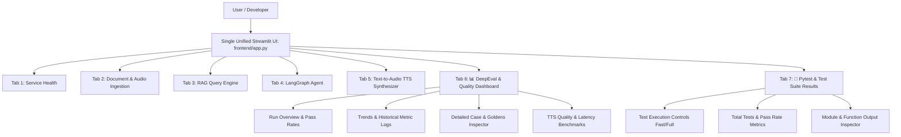

# Unified Streamlit UI & Integrated Evaluation Dashboard Specification

> **Purpose:** Consolidation plan to merge the standalone `eval_dashboard.py` into `frontend/app.py` as a native tab, providing a single, unified web UI for health checks, document/audio ingestion, RAG/Agent queries, TTS synthesis, and DeepEval evaluation analytics.
> **Scope:** Consolidate Streamlit interfaces into 1 single application (`frontend/app.py`), eliminate multi-port confusion, and deprecate redundant dashboard launcher scripts.

---

## 1. Executive Summary & Problem Statement

Currently, the application maintains two separate Streamlit web interfaces:
1. `frontend/app.py`: Main interactive UI for RAG/Agent queries, document/audio ingestion, and TTS synthesis.
2. `frontend/eval_dashboard.py`: Standalone evaluation dashboard for viewing DeepEval metrics, run history, and Goldens test cases.

Running two separate Streamlit servers on different ports (`8501` and `8502`) creates friction and redundant process management. Merging the evaluation metrics, test case inspector, and synthetic generator into `frontend/app.py` as a 6th tab (**"📊 DeepEval & Quality Dashboard"**) provides a seamless single-pane experience.



---

## 2. Target Architecture & Tab Layout

### Main Application Tabs (`frontend/app.py`):
1. **Service Health**
2. **Document & Audio Ingestion**
3. **RAG Query Engine**
4. **LangGraph Agent**
5. **Text-to-Audio (TTS) Synthesizer**
6. **📊 DeepEval & Quality Dashboard**
7. **🧪 Pytest & Test Suite Results** *(NEW CONSOLIDATED TAB)*

### Inner Sections in Tab 6 (DeepEval & Quality Dashboard):
- **Run Overview**: Aggregate scores, pass rates, and SLA compliance metrics for the selected evaluation run (`latest.json` or historical run).
- **Trends & Historical Run Comparison**: Time-series charts for Faithfulness, Relevancy, Hallucination, and Latency (`eval_results/metrics.csv` & `eval_results/history/`).
- **Detailed Case & Goldens Inspector**: Test case viewer for Goldens (`knowledge_base_cases.json`) and Synthetic test cases (`synthetic_cases.json`).
- **TTS Quality & Benchmark Metrics**: Audio signal quality (SNR, clipping), pronunciation (WER/CER), latency (RTF), and benchmark results (`tts_benchmark_results.json`).
- **Quick Synthetic Generator**: Sidebar/Button trigger to generate synthetic evaluation data from `memory/documents.json`.

### Inner Sections in Tab 7 (Pytest & Test Suite Results):
- **Test Suite Controls**: Interactive execution buttons (`Run Fast Unit Tests`, `Run Full Test Suite`).
- **Summary Metrics**: Total tests, passed, failed, duration, pass rate %.
- **Module & Status Filter**: Filter results by test module (`test_api_routes.py`, `test_rag_pipeline.py`, etc.) and status (`PASSED`, `FAILED`, `SKIPPED`).
- **Detailed Case Inspector**: Expanders for test functions showing execution time, captured stdout, stderr, and failure tracebacks.


---

## 3. Implementation Plan by Phases

### Phase 1: Modularize Dashboard Rendering (`frontend/app.py`)
- Extract dashboard rendering logic from `frontend/eval_dashboard.py` into a reusable helper function `render_eval_dashboard()` or modular imports in `frontend/app.py`.
- Preserve path imports and sys.path setup so `evals/` and `app/` resolve cleanly without import conflicts.

### Phase 2: Add Tab 6 to `frontend/app.py`
- Update `st.tabs()` call in `frontend/app.py`:
  ```python
  tabs = st.tabs([
      "Health",
      "Document & Audio Ingestion",
      "RAG Query",
      "LangGraph Agent",
      "Text-to-Audio (TTS)",
      "📊 DeepEval & Quality Dashboard"
  ])
  ```
- Implement `with tabs[5]: render_eval_dashboard()` incorporating:
  - Run selector (`Latest Run` or historical run files).
  - Metrics Overview (Pass rate, Faithfulness, Relevancy, Precision, Hallucination).
  - Historical Trend Charts (`eval_results/metrics.csv`).
  - Detailed Case Inspector for Goldens & Synthetic test cases.
  - TTS Quality Benchmark Results (`evals/results/tts_benchmark_results.json`).

### Phase 3: Update Scripts & Documentation
- Update `scripts/run_eval_dashboard.sh` to launch `streamlit run frontend/app.py`.
- Update `README.md` to reference the single unified UI (`frontend/app.py`).

---

## 4. Summary of Recommended File Changes

- 🆕 `file:///Users/sulabh/Documents/Knowledge%20Base%20Application/.skills/unified-streamlit-ui.md` *(This Plan File)*
- ✏️ `file:///Users/sulabh/Documents/Knowledge%20Base%20Application/frontend/app.py` *(Unified UI with 6th Tab)*
- ✏️ `file:///Users/sulabh/Documents/Knowledge%20Base%20Application/scripts/run_eval_dashboard.sh` *(Launcher Update)*
- ✏️ `file:///Users/sulabh/Documents/Knowledge%20Base%20Application/README.md` *(Documentation Update)*

---

## 5. Implementation & Verification Checklist

- [ ] Create `.skills/unified-streamlit-ui.md` specification.
- [ ] Add Tab 6 (`📊 DeepEval & Quality Dashboard`) to `frontend/app.py`.
- [ ] Render Run Overview, History Trends, Goldens/Synthetic Case Inspector, and TTS Benchmarks in Tab 6.
- [ ] Verify single Streamlit server (`streamlit run frontend/app.py`) serves all features.
- [ ] Update `README.md` and `run_eval_dashboard.sh`.
